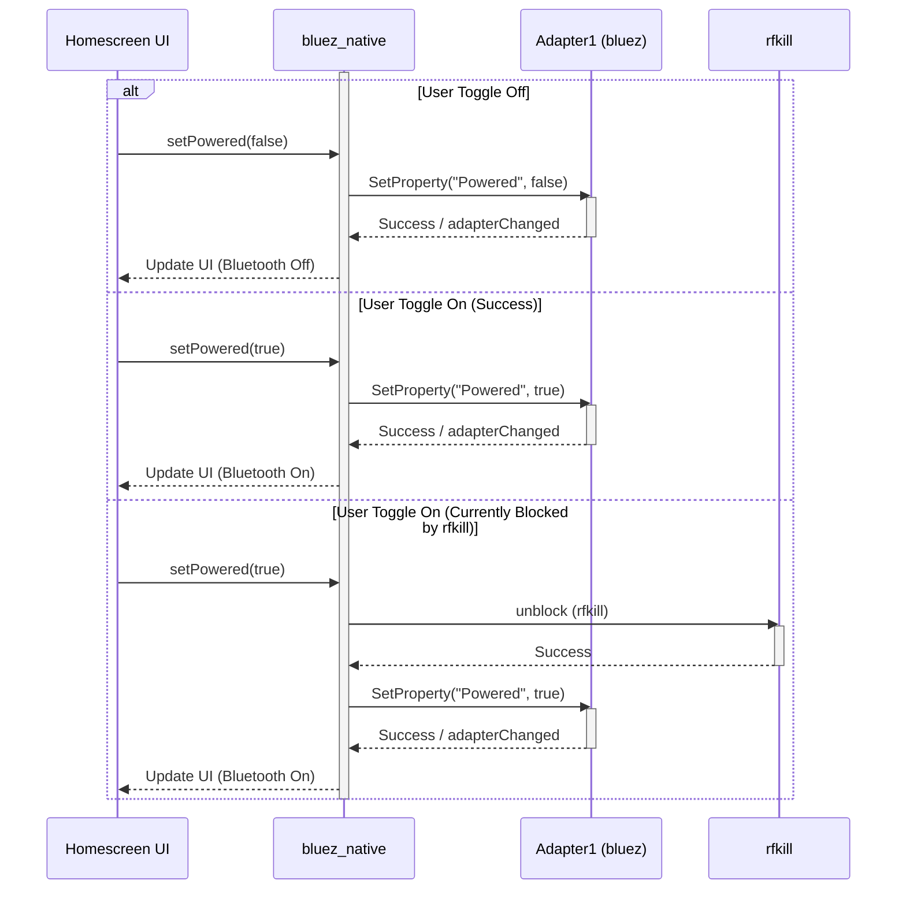
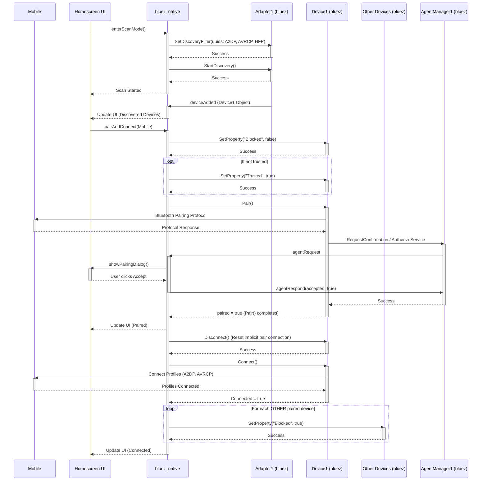
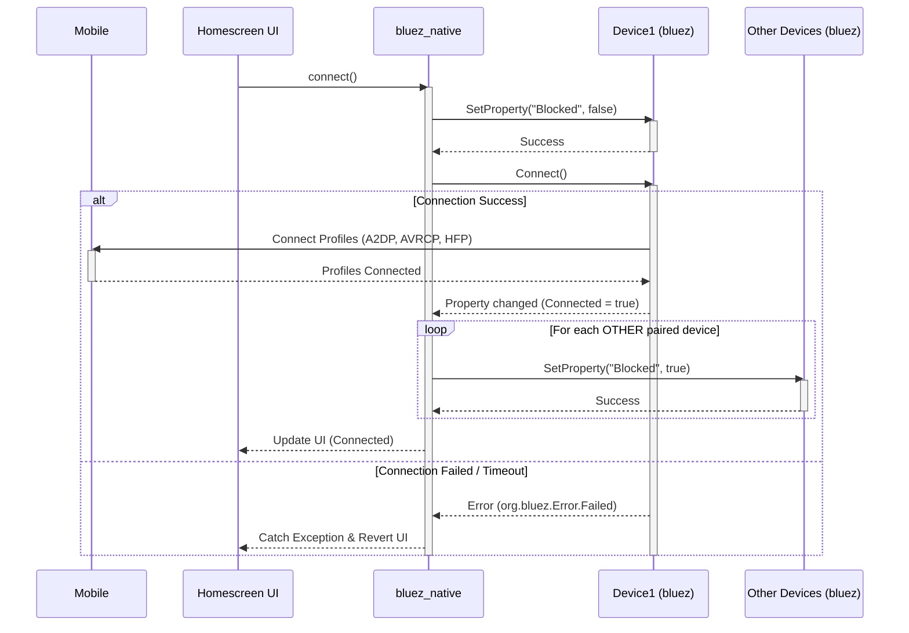
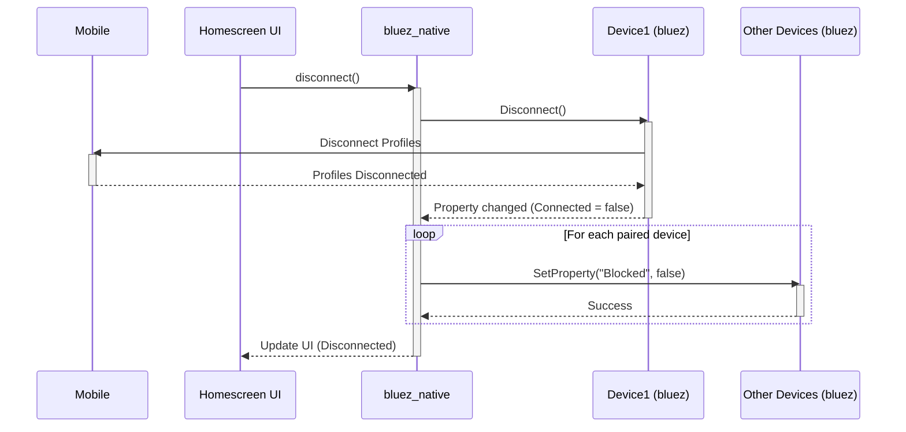
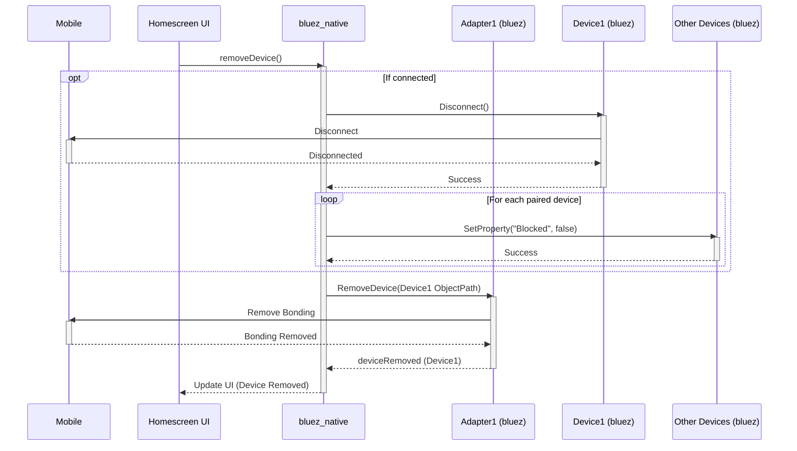
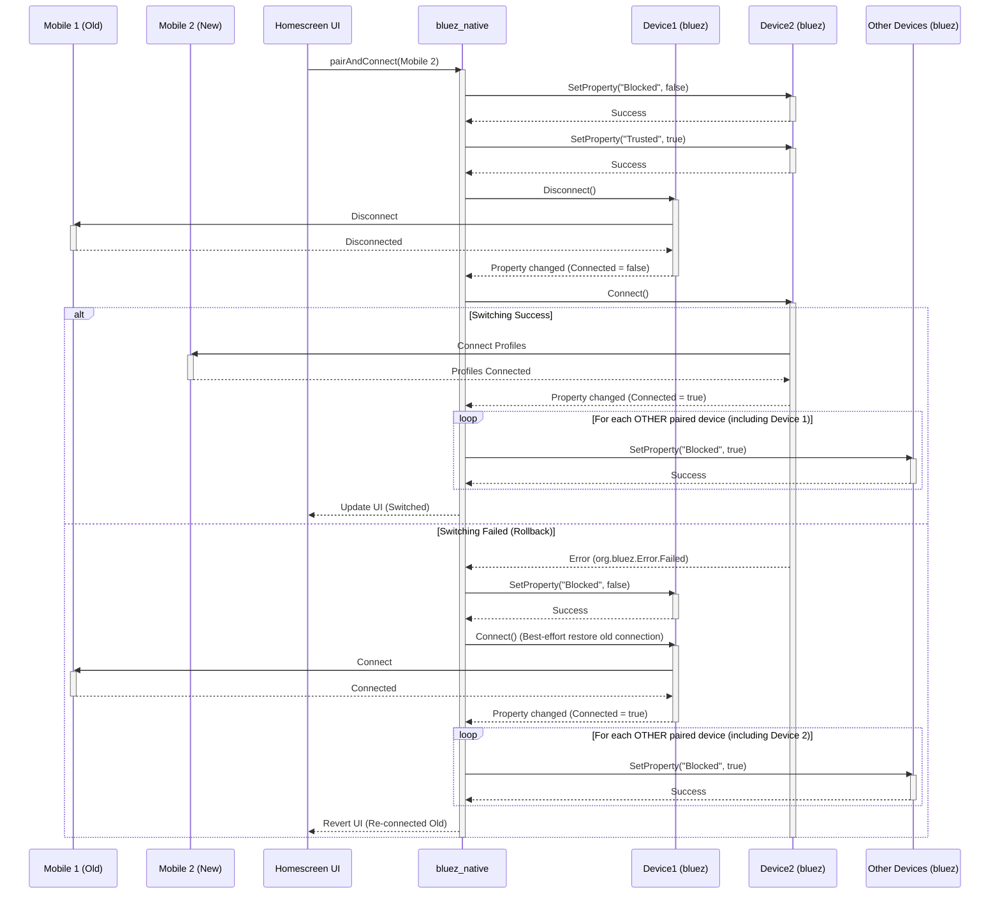

# Bluetooth Sequence Diagrams (Detailed with Activations, D-Bus Objects, & Block Logic)

## 1. Bluetooth On/Off

## 2. Pairing

## 3. Connecting Saved Device

## 4. Disconnect

## 5. Removing

## 6. Switching

